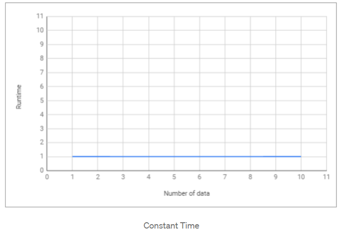
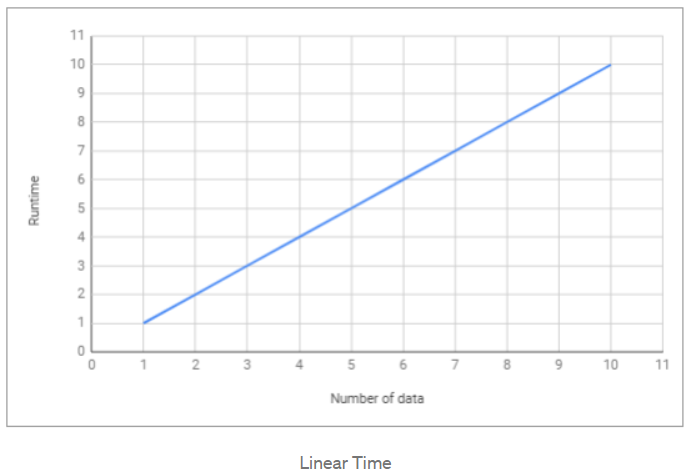
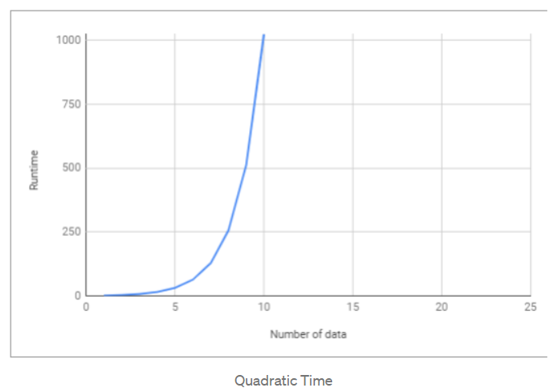
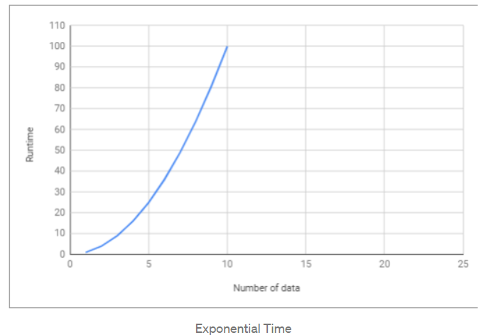

># **Penjelasan Sederhana Tentang Time Complexity dan Big-O Notation**

```
Setiap programmer yang baik menggunakan jalan paling efektif 
dan efisien untuk menyelesaikan masalah mereka. Dan untuk
melakukannya, kita harus tahu bagaimana meminimalkan kerumitan
```
Kompleksitas suatu algoritma dibagi menjadi 2, yaitu *Time Complexity* dan *Space Complexity*.

**Time Complexity** adalah seberapa lama waktu yang diperlukan untuk menjalankan suatu algoritma. Sedangkan **Space Complexity** adalah seberapa besar memori yang kita gunakan untuk menjalankan suatu algoritma. Dan disini kita hanya akan membahas tentang **Time Complexity**.

# **Algoritma**

Sederhananya, algoritma adalah serangkaian proses yang dilakukan secara berurutan untuk menyelesaikan sebuah permasalahan. Algoritma bisa bermacam-macam tergantung kepada siapa yang membuat algoritma tersebut. 

Seperti halnya yang sering kita hadapi dalam permasalahan sehari-hari, ketika kita akan berpergian ke suatu tempat. Kita tahu ada banyak jalan yang bisa dilalui untuk bisa sampai di tempat tujuan.

**Time Complexity Analysis** adalah suatu cara sederhana untuk mengetahui berapa lama waktu yang dibutuhkan untuk menjalankan suatu algoritma dengan input tertentu (n). Biasanya lebih dikenal dengan sebutan **Big-O Notation**.

## **Jadi, Apa Itu Notasi Big-O?**

Big-O Notation adalah cara untuk mengkonversi keseluruhan langkah-langkah suatu algoritma kedalam bentuk Aljabar, yaitu dengan menghiraukan konstanta yang lebih kecil dan koefisien yang tidak berdampak besar terhadap keseluruhan kompleksitas permasalahan yang diselesaikan oleh algoritma tersebut.

```
Regular       Big-O
2             O(1)   --> It's just a constant number
2n + 10       O(n)   --> n has the largest effect
5n^2          O(n^2) --> n^2 has the largest effect
```

Sederhananya, semua contoh yang ada diatas mengatakan bahwa **“kita hanya akan melihat faktor yang memiliki dampak paling besar terhadap nilai yang dihasilkan oleh algoritma tersebut”**.

Terdapat beberapa macam time complexity, diantaranya:

## O(1) — Constant Time

**Constant Time** artinya banyaknya input yang diberikan kepada sebuah algoritma, tidak akan mempengaruhi waktu proses (runtime) dari algoritma tersebut.

```
let myArray = [1, 5, 0, 6, 1, 9, 9, 2];
function getFirst(input){
   return input[0]; // selalu melakukan 1 langkah
}
let firstEl = getFirst(myArray);
```

Contoh diatas, terdapat sebuah fungsi untuk mengambil elemen pertama dari sebuah input array. Kita bisa melihat bahwa berapapun jumlah array yang diberikan kepada fungsi tersebut, dia akan selalu melakukan 1 hal, yaitu mengambil elemen pertama. Itu artinya **jumlah input yang diberikan tidak mempengaruhi waktu proses (runtime) dari algoritma tersebut.**

<p align="center" width=40%></p>

## O(log n) — Logarithmic Time

**Logarithmic Time** artinya ketika kita memberikan input sebesar n terhadap sebuah fungsi, jumlah tahapan yang dilakukan oleh fungsi tersebut berkurang berdasarkan suatu faktor. Salah satu contohnya adalah algoritma **Binary Search.**

**Binary Search** adalah algoritma yang kita gunakan dalam mencari posisi nilai dari suatu array dengan cara ‘mengeliminasi’ setengah dari array input untuk mempercepat proses pencarian.

```
let sortedArray = [11, 24, 30, 43, 51, 61, 73, 86];
function isExists(number, array){
    var midPoint = Math.floor( array.length /2 );
    if( array[midPoint] === num) return true;
    let isFirstHalf = false;
    if( array[midPoint] < num ) isFirstHalf = true;
  
    else if( array[midpoint] > num ) isFirstHalf = false;
    if (array.length == 1) return false;
    else { 
        // memanggil fungsi yang sama dengan mengeleminiasi setengah dari input array
        if (isFirstHalf) 
            return isExists(number, getFirstHalf(array));
        else 
            return isExists(number, getSecondHalf(array));
    }
}
isExists (24, sortedArray); // return true
isExists (27, sortedArray); // return false
```

>*Catatan: Fungsi rekursif biasanya Logarithmic*

# O(n) — Linear Time

**Linear Time** adalah ketika runtime dari fungsi kita berbanding lurus dengan jumlah input yang diberikan.

```
let myArray = [1, 5, 0, 6, 1, 9, 9, 2];
function getMax(input){
    var max = 0;
    for (var i=0; i<input.length; i++){
        if (max < input[i])
            max = input[i];
    }
    return max;
}
let maxNumber = getMax(myArray);
```

Kita bisa melihat bahwa **semakin banyak jumlah input yang diberikan, maka waktu proses/runtime dari fungsi tersebut akan semakin besar.**

<p align="center" width=40%></p>

# O(n²) — Quadratic Time

**Quadratic Time** adalah ketika runtime dari fungsi kita adalah sebesar n^2, dimana n adalah jumlah input dari fungsi tersebut. Hal tersebut bisa terjadi karena kita menjalankan **fungsi linear didalam fungsi linear (n*n).**

```
let myArray = [1, 5, 0, 6, 1, 9, 9, 2];
function sort(input){
    var sortedArray = [];
    for (var i=0; i<input.length; i++){ // O(n)
        let min = input[i];
        for (var j=i+1; i<input.length; i++){ // O(n)
            if (input[i] < input[j])
                min = input[j];
        }
        sortedArray.push(min);
    }
    return sortedArray;
}
let sortedArray = sort(myArray);
```

<p align="center" width=40%></p>

# O(2^n) — Exponential Time

**Exponential Time** biasanya digunakan dalam situasi dimana kita tidak terlalu tahu terhadap permasalahan yang dihadapi, sehingga mengharuskan kita mencoba setiap **kombinasi** dan **permutasi** dari semua kemungkinan.

<p align="center" width=40%></p>

# **Kesimpulan**

Sebagai programmer, kita sering kali dihadapkan dengan adanya beberapa solusi untuk sebuah permasalahan dan kita dibingungkan dengan pertanyaan “*mana solusi yang lebih efisien?*”.

Dengan memahami **Big-O Notation**, kita akan lebih mudah dalam melihat mana algoritma yang lebih efisien yang bisa kita gunakan untuk menyelesaikan permasalahan yang sedang dihadapi.